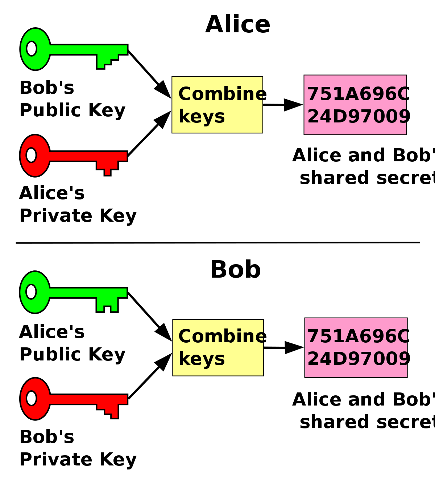

# Generación de llaves

## 1. Asimétrica - Public-key authenticated encryption

En este encriptado se usan un dos pares, el ParA y el ParB, ambos pares tienen una llave pública y una llave privada/secreta. Estas dos llaves serán necesarias a la hora de encriptar y desencriptar. Para encriptar se necesita `ParA.privateKey + ParB.publicKey` y para desencriptar se necesita `ParB.privateKey + ParA.publicKey`.

## Diffie-Hellman, Curvas elípticas y Precomputed Shared Key (PSK):

También hay que tener en cuenta que este encriptado también puede funcionar gracias al intercambio de llaves de Diffie-Hellman y al intercambio de llaves con curvas elípticas. Existe este término llamado *Precomputed Shared Key*, una *PKS* es la llave que si se desea se puede crear al momento de combinar tu llave privada con la llave pública de la persona con la que te deseas comunicar, tal como se muestra en la siguiente imagen:

Esta llave se puede crear y usar con la librería que estamos utilizando en este proyecto.

Si es que se desea se puede encriptar con la *PSK* en lugar de la llave pública del destinatario. En la documentación de la librería se usa esta función para realizar lo que se mencionó anteriormente:

```javascript
nacl.box.before(theirPublicKey, mySecretKey)
```

Esta función crea una *PSK* a partir de las llaves que se le den como parámetro.

```javascript
nacl.box.after(message, nonce, sharedKey)
```

Esta función encripta un mensaje con la *PSK* previamente creada.

```javascript
nacl.box.open.after(box, nonce, sharedKey)
```

Y esta última función desencripta el mensaje con la *PSK*.

## Nonce

En criptografía, un nonce es un número arbitrario que se puede 
usar una única vez en una comunicación criptográfica. A menudo es un 
número aleatorio o pseudoaleatorio emitido en un protocolo de 
autenticación para garantizar que las comunicaciones antiguas no se 
puedan reutilizar en ataques de playback.
